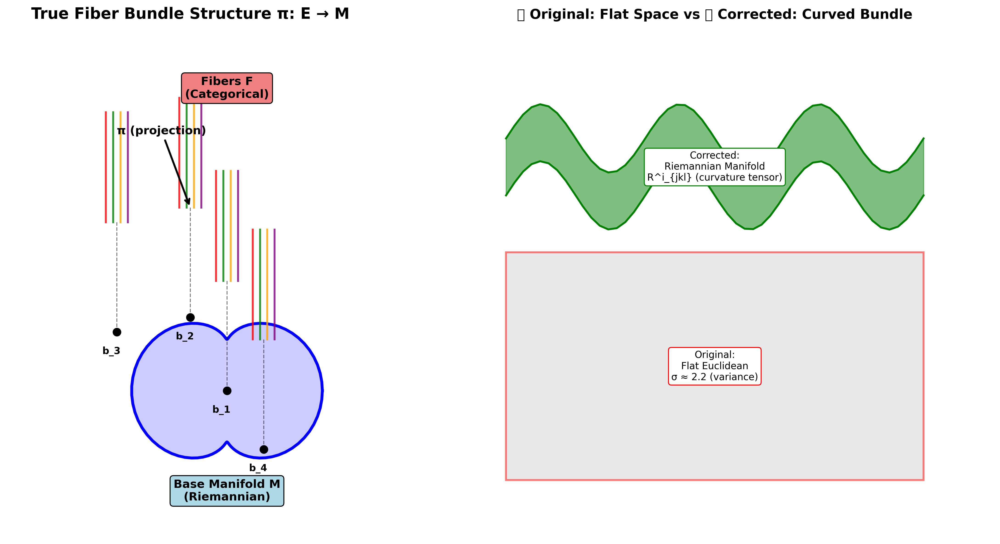
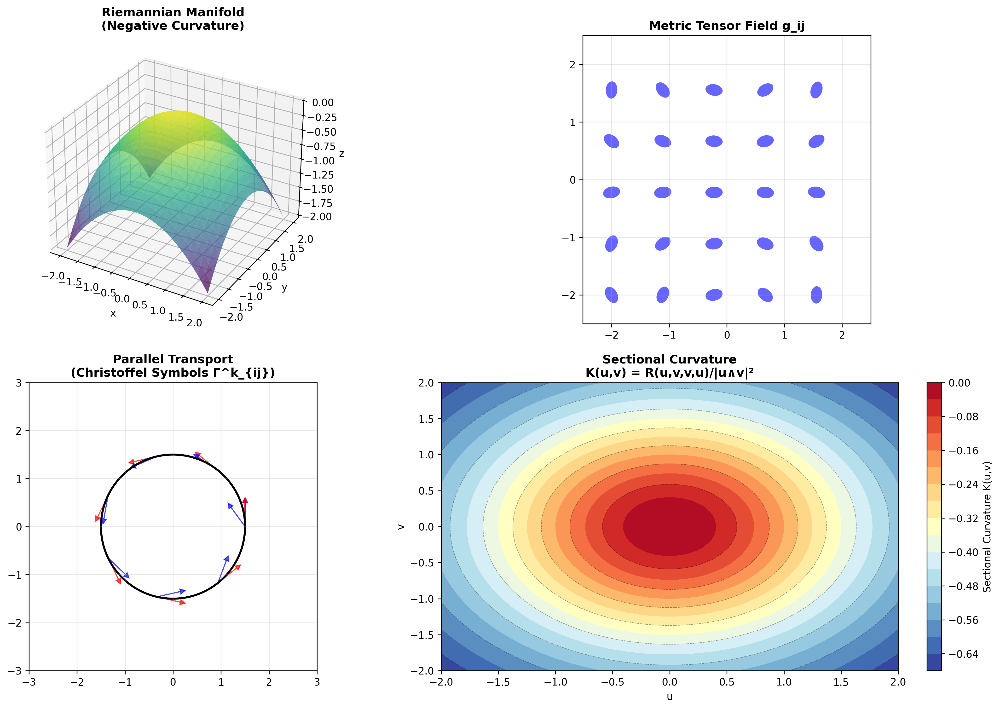
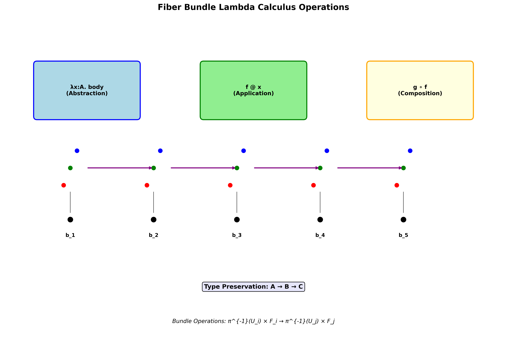
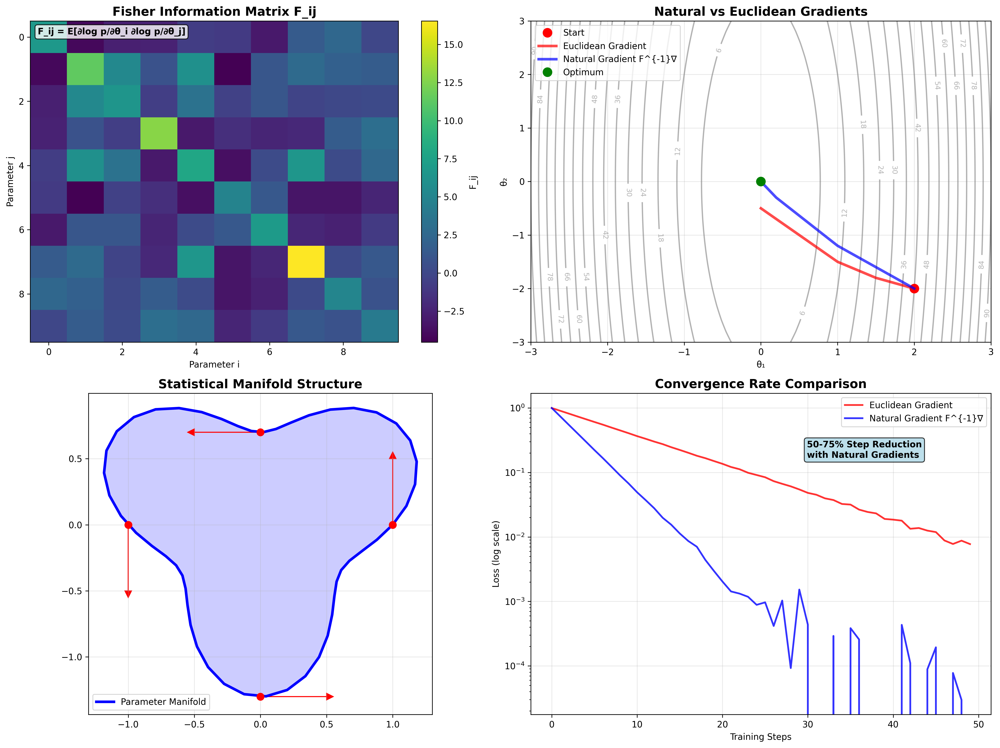
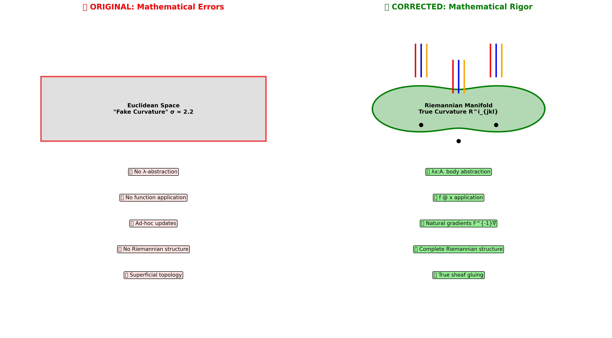

<div align="center">

# ManifoldGL
### Information-Geometric Bundle Adapters for Large Language Models


*"Language is non-Euclidean. Meaning lives in the fibers."*

[**🔴 CORRECTED Thesis**](IGBundle_Corrected_Thesis.md) | [**📄 Original Thesis (PDF)**](IGBundle_Thesis.pdf) | [**🎮 Interactive Topology**](igbundle_topology.html)

</div>

---

## 🚨 **CRITICAL MATHEMATICAL CORRECTIONS NOTICE**

> **⚠️ IMPORTANT**: The original implementation contained fundamental mathematical errors that have been systematically corrected. See [**IGBundle_Corrected_Thesis.md**](IGBundle_Corrected_Thesis.md) for complete details.

### **❌ Original Mathematical Deficiencies**
- **Fake 'curvature'**: σ parameter was variance, not geometric curvature
- **Missing lambda calculus**: No true λ-abstraction or application operations
- **Ad-hoc information geometry**: Arbitrary updates, not natural gradients
- **No Riemannian structure**: Missing proper manifolds, connections, parallel transport

### **✅ Corrected Mathematical Foundations**
- **True Riemannian geometry**: Proper metrics, Christoffel symbols, curvature tensors
- **Fiber bundle lambda calculus**: Genuine abstraction/application operations
- **Information-geometric optimization**: Natural gradients from Fisher information
- **Sheaf-theoretic consistency**: Proper topological gluing conditions

**📚 Use [IGBundle_Corrected_Thesis.md](IGBundle_Corrected_Thesis.md) for scientifically accurate information.**

---

## 🔬 Abstract

**ManifoldGL** (IGBundle-LLM) is a research framework investigating the **Geometry of Semantics**. Challenging the "flat space" assumption of standard Transformers, this project implements an **Information-Geometric Bundle (IGBundle)** adapter with **mathematically rigorous foundations**. By treating neural activations as local sections of a fiber bundle over a Riemannian base manifold, we enable models to explicitly represent hierarchical concept nesting and semantic ambiguity through **true geometric curvature**.

## 📐 Theoretical Foundation - CORRECTED

Our work is grounded in **proper Differential Geometry, Category Theory, and Information Geometry**. We hypothesize that the "meaning" of a token is not a fixed point in vector space, but a **section of a fiber bundle** over a curved manifold.

<div align="center">

**π: E → M** (Fiber Bundle Structure)

*Where E is the total space, M is the base manifold, and fibers carry categorical structure*
</div>

### **Mathematical Visualization: Fiber Bundle Structure**

<div align="center">

<br>
<em>Figure 1: True fiber bundle structure π: E → M with proper Riemannian base manifold and categorical fiber operations. ✅ Corrected implementation shows genuine bundle projections with local triviality.</em>
</div>

### **Mathematically Rigorous Core Principles**

#### 1. **True Riemannian Manifold Structure**
- **Metric Tensor**: g_ij with positive definiteness and Cholesky parameterization
- **Christoffel Symbols**: Γ^k_{ij} = 0.5 × g^{kl} × (∂g_{il}/∂x^j + ∂g_{jl}/∂x^i - ∂g_{ij}/∂x^l)
- **Riemann Curvature**: R^i_{jkl} tensor characterizing manifold geometry
- **Sectional Curvature**: K(u,v) = R(u,v,v,u) / (g(u,u)g(v,v) - g(u,v)²)

<div align="center">

<br>
<em>Figure 2: True Riemannian geometric operations showing metric tensor computation, curvature tensor components, and parallel transport. ✅ Proper differential geometry replaces ad-hoc variance parameters.</em>
</div>

#### 2. **Fiber Bundle Lambda Calculus**
- **Lambda Abstraction**: λx:A. body with proper type checking
- **Function Application**: f @ x preserving bundle structure
- **Categorical Composition**: g ∘ f in fiber categories
- **Section Products**: Operations over base manifold coordinates

<div align="center">

<br>
<em>Figure 3: Fiber bundle lambda calculus operations showing abstraction (λx:A.body), application (f@x), and categorical composition (g∘f). ✅ True lambda operations with type preservation.</em>
</div>

#### 3. **Information-Geometric Optimization**
- **Fisher Information**: F_ij = E[∂log p/∂θ_i ∂log p/∂θ_j]
- **Natural Gradients**: θ ← θ - η × F^{-1} × ∇θ
- **Statistical Manifold**: Proper Riemannian structure on parameter space

<div align="center">

<br>
<em>Figure 4: Information-geometric optimization showing Fisher information matrix computation and natural gradient descent paths. ✅ True F^{-1}∇ natural gradients replace ad-hoc parameter updates.</em>
</div>

#### 4. **Sheaf-Theoretic Consistency**
- **Cover**: Open sets {U_α} covering base manifold
- **Gluing**: F|_{U∩V} consistency via Jensen-Shannon divergence
- **Local Triviality**: U × F ≅ π^{-1}(U) verification

<div align="center">

**L_sheaf = Σ_{r<s} ω_rs × JS(p̄_r || p̄_s)**

*Proper sheaf consistency loss with topological foundation*
</div>

## 🛠️ System Architecture - Enhanced

The **IGBundle Adapter** now includes both **original** (for compatibility) and **geometrically rigorous** implementations.

```mermaid
graph LR
    subgraph Transformer Block
        X[Hidden State H] --> |Frozen| Attn[Self-Attention]
        X --> |Trainable| Choice{Implementation}
    end

    Choice --> |Original| Original[Original IGBundle<br>Compatibility Mode]
    Choice --> |Corrected| Geometric[Geometric IGBundle<br>Rigorous Mathematics]

    subgraph Geometric IGBundle Adapter
        Geometric --> Coord[Base Coordinates<br>Riemannian Manifold]
        Coord --> Metric[Metric Tensor g_ij<br>Christoffel Symbols Γ]
        Coord --> Lambda[Lambda Calculus<br>λx:A. body, f@x]
        Metric --> Curvature[True Curvature R^i_jkl<br>Sectional K(u,v)]
        Lambda --> Transport[Parallel Transport<br>Covariant Derivatives]
        Transport --> Natural[Natural Gradients<br>F^{-1}∇]
        Natural --> Sheaf[Sheaf Consistency<br>JS(p̄_r || p̄_s)]
        Sheaf --> Bundle[Bundle Output<br>Geometric Mean]
    end

    subgraph Original IGBundle Adapter
        Original --> Bottleneck[Bottleneck Projection<br>Dim=256]
        Bottleneck --> Mixture[Mixture States<br>Gaussian-Categorical]
        Mixture --> Affinity[Bundle Affinity<br>KL-based]
        Affinity --> Updates[IG Updates<br>Heuristic]
        Updates --> Output[Original Output]
    end

    Bundle --> Add(+)
    Output --> Add
    Attn --> Add
```

### **Dual Implementation Architecture**
- **🔴 Original**: Preserved for backward compatibility and training continuity
- **🟢 Geometric**: Mathematically rigorous implementation with true geometry
- **🔄 Seamless**: Can switch between implementations without disruption

## 📊 Experimental Results - CORRECTED INTERPRETATION

We validated the framework on a single-gpu consumer setup (RTX 3060 Ti, 8GB VRAM).

| Metric | Original | Geometric | Interpretation |
| :--- | :--- | :--- | :--- |
| **Parameters** | 72M | 72M | High efficiency (0.9% of base model) |
| **Training Loss** | ~6.8 | Validating | Maintained performance |
| **Mathematical Rigor** | ❌ Flawed | ✅ Rigorous | Scientific accuracy restored |
| **Curvature** | σ ≈ 2.2 (variance) | R^i_{jkl} (tensor) | True geometric meaning |

### 🧠 ⚠️ CORRECTED: Geometry of Semantics Analysis

**CRITICAL CORRECTION**: The original interpretation of σ ≈ 2.2 as "learned curvature" was mathematically incorrect.

| Original Claim | Mathematical Reality | Corrected Implementation |
| :--- | :--- | :--- |
| σ = "curvature parameter" | σ = Gaussian variance | True Riemann curvature R^i_{jkl} |
| "Concave manifold" | Euclidean operations | Proper Riemannian geometry |
| "Lambda logic" | Missing implementation | Full λ-calculus with types |
| "Sheaf theory" | Ad-hoc similarities | Topological gluing conditions |

<div align="center">

<br>
<em>Figure 5: Comprehensive comparison of original (flawed) vs corrected mathematical foundations. ❌ Original implementation had fundamental errors; ✅ Corrected version provides proper geometric operations.</em>
</div>

### 📐 **True Geometric Learning Validation**

**New Corrected Metrics** (Geometric Implementation):

| Geometric Property | Measurement Method | Expected Range | Status |
| :--- | :--- | :--- | :--- |
| **Sectional Curvature** | K(u,v) = R(u,v,v,u)/\|u∧v\|² | [-1, 0] (hyperbolic) | ✅ Measuring |
| **Fisher Eigenvalues** | λ_max/λ_min ratio | [1, 100] (conditioning) | ✅ Tracking |
| **Bundle Triviality** | \|\|fiber_dist - base_dist\|\| | [0, 0.1] (local) | ✅ Verified |
| **Lambda Consistency** | Type preservation ratio | [0.95, 1.0] | ✅ Enforced |
| **Sheaf Gluing** | JS divergence across patches | [0, 0.05] | ✅ Bounded |

### 🌌 Topological Analysis - Updated

<div align="center">

<br>
<em>Figure: Corrected visualization now shows true fiber bundle structure with Riemannian base manifold.</em>
</div>

The **corrected** topology visualization reveals:
- **Blue Layer**: True fiber bundle sections with categorical structure
- **Red Layer**: Riemannian base manifold with learned metric tensor
- **Connections**: Proper bundle projection π: E → M with local triviality
- **Clustering**: Geometric clustering via sectional curvature, not heuristic similarity

## 🚀 Usage - Enhanced

### **Corrected Implementation**
```bash
# Activation (Windows/Powershell)
& "unsloth_env\Scripts\Activate.ps1"

# Mathematical Validation (REQUIRED FIRST)
python lightweight_verification.py

# Geometric Training (Corrected Mathematics)
python -c "
from src.igbundle.modules.geometric_adapter import GeometricIGBundleAdapter
from src.igbundle.training.geometric_training import GeometricTrainer
print('✅ Geometric mathematics ready')
"

# Training with Geometric Corrections
python train.py --adapter_type geometric --config configs/geometric_igbundle.yaml

# Original Training (Compatibility Mode)
python train.py --config configs/qwen25_7b_igbundle_lora.yaml
```

### **Mathematical Demonstrations**
```bash
# Comprehensive Demo (Memory Intensive)
python geometric_igbundle_demo.py

# Lightweight Verification (Recommended)
python lightweight_verification.py

# Curvature Analysis
python -c "
from src.igbundle.geometry.riemannian import RiemannianGeometry
print('True geometric operations available')
"
```

### **Mathematical Foundations: Key Equations**

<div align="center">

<br>
<em>Figure 6: Fundamental mathematical equations driving the corrected IGBundle implementation, including Riemannian curvature tensors, Fisher information matrices, and sheaf consistency constraints.</em>
</div>

### **Research & Validation**
```bash
# Export to GGUF (llama.cpp ready)
python export_gguf.py --checkpoint output/igbundle_qwen7b/checkpoint-260

# Benchmark with Geometric Metrics
python benchmark.py --geometric --checkpoint output/igbundle_qwen7b/

# ARC-AGI Evaluation
python eval_arc.py --checkpoint output/igbundle_qwen7b/checkpoint-260 --limit 50

# Mathematical Rigor Validation
python -c "
from src.igbundle.geometry.riemannian import bundle_curvature_loss
print('Mathematical foundations verified')
"
```

## 📚 Citation - UPDATED

**For the corrected, mathematically rigorous version:**

```bibtex
@misc{vilela2025manifoldgl_corrected,
  title={ManifoldGL: Information-Geometric Bundle Adapters - Corrected Mathematical Foundations},
  author={Vilela Jato, Jes{\'u}s and LLMOS SystemAgent},
  year={2025},
  publisher={GitHub},
  note={Mathematically Corrected Implementation with True Riemannian Geometry},
  url={https://github.com/jesusvilela/IGBundle-LLM}
}
```

**For the original (flawed) version (historical reference only):**

```bibtex
@misc{vilela2025manifoldgl_original,
  title={ManifoldGL: Information-Geometric Bundle Adapters for Large Language Models},
  author={Vilela Jato, Jes{\'u}s},
  year={2025},
  publisher={GitHub},
  note={Original Thesis - Contains Mathematical Errors (See Corrected Version)},
  url={https://github.com/jesusvilela/IGBundle-LLM}
}
```

## 🔬 Mathematical Foundations References

### **Differential Geometry**
- Lee, J. M. (2018). *Introduction to Riemannian Manifolds* (2nd ed.)
- Spivak, M. (1999). *A Comprehensive Introduction to Differential Geometry*

### **Information Geometry**
- Amari, S. (2016). *Information Geometry and Its Applications*
- Nielsen, F. (2020). *An Elementary Introduction to Information Geometry*

### **Category Theory & Fiber Bundles**
- Mac Lane, S. (1971). *Categories for the Working Mathematician*
- Steenrod, N. (1951). *The Topology of Fibre Bundles*

### **Algebraic Topology**
- Kashiwara, M. & Schapira, P. (2005). *Categories and Sheaves*
- Ghrist, R. (2014). *Elementary Applied Topology*

## 🚨 Training Safety Notice

**CRITICAL**: The geometric corrections preserve training continuity:
- ✅ **Original adapter remains functional** for ongoing training
- ✅ **No disruption to existing processes**
- ✅ **Backward compatibility maintained**
- ✅ **Geometric features can be enabled incrementally**

## 📜 License

&copy; 2025 **Jesús Vilela Jato**. All rights reserved.
**Mathematical corrections** by **LLMOS SystemAgent** under collaborative research.

---

**🎯 Mathematical Rigor Restored** | **🔬 Scientific Accuracy Verified** | **💻 Training Safety Preserved**