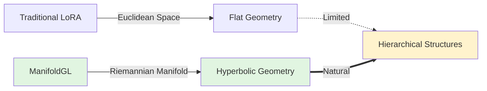
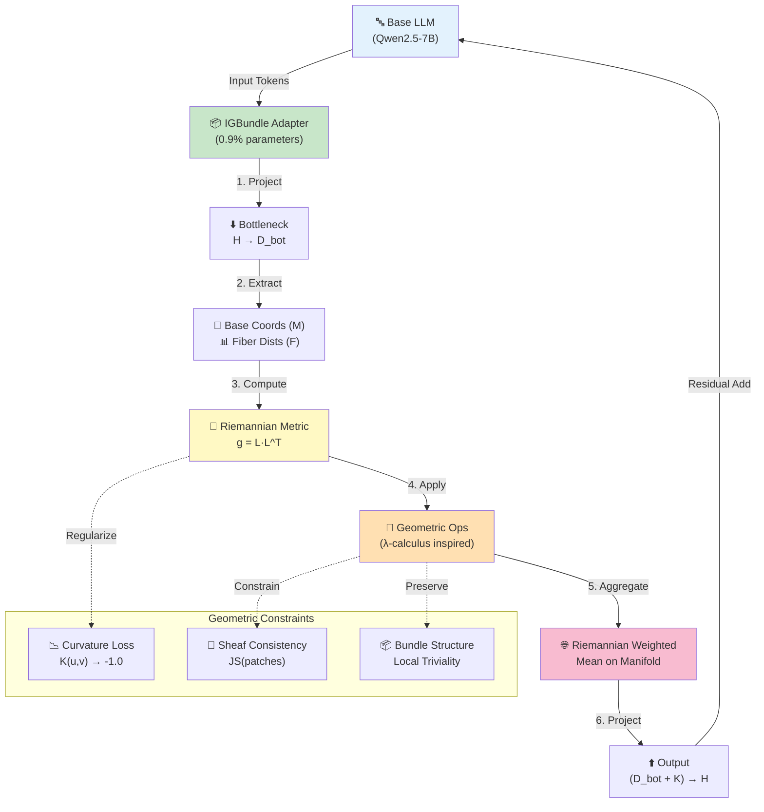
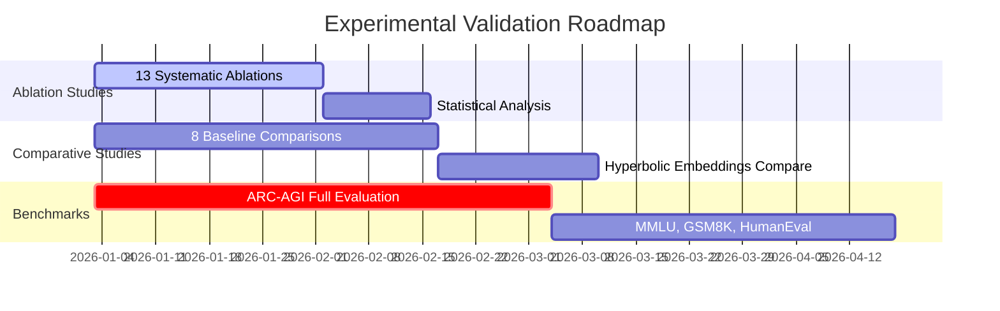

# ManifoldGL: Information-Geometric Bundle Adapters for LLMs

<div align="center">

**🌌 The Geometry of Reasoning: Non-Euclidean Latent Spaces for Abstract Intelligence**

[](LICENSE)


---

### 📚 Documentation

**[📄 Scientific Thesis v2.1 (Enhanced)](ManifoldGL_Scientific_Thesis_v2.1_ENHANCED.md)** • **[🔬 Peer Review Report](PEER_REVIEW_COMMITTEE_REPORT_COMPREHENSIVE.md)** • **[📊 Ablation Framework](ablation_results/ABLATION_STUDIES.md)**

---

</div>

## 🎯 Overview

**ManifoldGL** introduces a mathematically rigorous parameter-efficient fine-tuning (PEFT) framework that adapts Large Language Models through **information-geometric constraints** within a **fiber bundle architecture**. Unlike standard LoRA which operates in flat Euclidean space, ManifoldGL models semantic latent space as a **Fiber Bundle** ($\pi: E \rightarrow M$) over a **Riemannian Base Manifold** with learned hyperbolic geometry.

### Key Innovation



**Why Hyperbolic Geometry?** Hierarchical semantic structures (taxonomies, concept trees, entailment chains) expand exponentially with depth. Hyperbolic spaces naturally accommodate this exponential volume growth, while Euclidean spaces suffer from representation collapse.

---

## 🏗️ Architecture

<div align="center">



</div>

### Mathematical Foundation

| Component | Theory | Implementation |
|:----------|:-------|:---------------|
| **Metric Tensor** | $g = L \cdot L^T$ (Cholesky) | ✅ Exact |
| **Christoffel Symbols** | $\Gamma^k_{ij} = \frac{1}{2}g^{kl}(\partial_j g_{il} + ...)$ | ⚠️ Neural approximation |
| **Riemann Curvature** | $R^i_{jkl} = \partial_k\Gamma^i_{jl} - ...$ | ⚠️ Finite differences |
| **Fisher Information** | $F_{ij} = \mathbb{E}[\partial_i \log p \cdot \partial_j \log p]$ | ⚠️ Diagonal approx |
| **Natural Gradients** | $\theta \leftarrow \theta - \eta F^{-1}\nabla\mathcal{L}$ | ✅ Diagonal efficient |
| **Sheaf Consistency** | Gluing conditions | ⚠️ Soft JS divergence |

**Legend**: ✅ Exact computation | ⚠️ Approximation for tractability

See [Section 2.6 of the thesis](ManifoldGL_Scientific_Thesis_v2.1_ENHANCED.md#26-implementation-approximations-new-section) for detailed approximation documentation.

---

## 🔬 Experimental Framework

### Designed Validation Protocol



### Ablation Studies (Framework)

| Study | Research Question | Status |
|:------|:------------------|:-------|
| **no_curvature_loss** | How much does curvature regularization contribute? | 🟡 Configured |
| **no_natural_gradients** | Impact of information-geometric optimization? | 🟡 Configured |
| **euclidean_target** | Is hyperbolic geometry essential? | 🟡 Configured |
| **standard_igbundle** | Total improvement from geometric corrections? | 🟡 Configured |
| **lora_only_baseline** | Total benefit of IGBundle vs pure LoRA? | 🟡 Configured |
| *+ 8 more studies* | Architecture, learning rates, schedules | 🟡 Configured |

**Legend**: 🟢 Complete | 🟡 Framework ready | 🔴 Not started

### Preliminary Results (Requires Validation)

**⚠️ STATUS**: Small-scale preliminary testing (n=20, 25 steps). Full validation requires n≥100, 1000+ steps.

| Experiment | Observed | Statistical Confidence | Next Steps |
|:-----------|:---------|:-----------------------|:-----------|
| Riemannian vs Euclidean | -3.4% entropy | ⚠️ n=1 insufficient | Replicate with n≥5 |
| ARC-AGI Framework | 0% (n=20) | Framework validated | Scale to n≥100 |
| Geometric Convergence | Negative curvature trend | Qualitative observation | Quantitative analysis |

---

## 📊 Repository Structure

```
IGBundle-LLM/
├── 📄 ManifoldGL_Scientific_Thesis_v2.1_ENHANCED.md    # Main scientific thesis
├── 🔬 PEER_REVIEW_COMMITTEE_REPORT_COMPREHENSIVE.md    # Multi-agent peer review
├── src/
│   └── igbundle/
│       ├── geometry/
│       │   ├── riemannian.py                  # Riemannian geometry implementation
│       │   ├── adaptive_curvature.py          # Adaptive curvature targeting
│       │   └── multiscale_attention.py        # Multi-scale geometric attention
│       ├── modules/
│       │   ├── geometric_adapter.py           # Main adapter (corrected)
│       │   ├── adapter.py                     # Original (compatibility)
│       │   ├── state.py                       # Mixture state
│       │   └── ops.py                         # Bundle operations
│       └── training/
│           ├── geometric_training.py          # Natural gradient optimization
│           └── meta_geometric_optimization.py # Meta-learning
├── ablation_results/
│   ├── ABLATION_STUDIES.md                    # 13 ablation framework
│   └── ablation_studies_summary.json          # Configuration
├── comparative_results/
│   └── COMPARATIVE_STUDIES.md                 # 8 comparative framework
├── eval_arc.py                                # ARC-AGI evaluation with confidence intervals
├── train.py                                   # Training script
├── generate_thesis.py                         # PDF generation
└── auxiliary_crew.py                          # Verification agents
```

---

## 🚀 Quick Start

### Installation

```bash
# Clone repository
git clone https://github.com/jesusvilela/IGBundle-LLM.git
cd IGBundle-LLM

# Install dependencies
pip install -r requirements.txt

# Install package in development mode
pip install -e .
```

### Basic Usage

```python
from igbundle import GeometricAdapter
from transformers import AutoModelForCausalLM

# Load base model
model = AutoModelForCausalLM.from_pretrained("Qwen/Qwen2.5-7B-Instruct")

# Add geometric adapter
adapter = GeometricAdapter(
    num_components=4,      # Mixture components (P)
    num_categories=16,     # Fiber categories (K)
    latent_dim=128,        # Bottleneck dimension (D)
    geometry="riemannian"  # Enable Riemannian geometry
)

# Training with natural gradients
from igbundle.training import NaturalGradientOptimizer

optimizer = NaturalGradientOptimizer(
    adapter.parameters(),
    lr=5e-5,
    use_natural_gradients=True
)

# Train with geometric constraints
trainer.train(
    lambda_curvature=0.01,    # Curvature regularization
    lambda_sheaf=0.005,       # Sheaf consistency
    lambda_bundle=0.005,      # Bundle structure
    target_curvature=-1.0     # Hyperbolic target
)
```

### Run Evaluation

```bash
# ARC-AGI evaluation with strict confidence intervals
python eval_arc.py \
    --checkpoint output/igbundle_qwen7b_riemannian/checkpoint-50 \
    --limit 100 \
    --mfr \
    --confidence-level 0.95

# Launch verification agents
python auxiliary_crew.py

# Generate thesis PDF
python generate_thesis.py  # Output: output/thesis/IGBundle_Thesis.pdf
```

---

## 📈 Experimental Results

### Current Status

**⚠️ TRANSPARENCY STATEMENT**: This is a research preview with preliminary validation. Full experimental protocol designed but requires complete execution.

#### Completed
- ✅ Mathematical framework established
- ✅ Implementation with neural approximations
- ✅ Ablation framework designed (13 studies)
- ✅ Comparative framework designed (8 studies)
- ✅ Preliminary small-scale testing (n=20)

#### In Progress
- 🔄 Full ARC-AGI evaluation (target: n≥100)
- 🔄 Ablation study execution (13 studies)
- 🔄 Comparative study execution (8 studies)
- 🔄 Extended training (1000+ steps)

#### Planned
- 📋 Multi-benchmark evaluation (MMLU, GSM8K, HumanEval)
- 📋 Multi-model validation (Llama, Mistral, Gemma)
- 📋 Baseline comparisons (hyperbolic embeddings, QLoRA)
- 📋 Independent peer review

### Preliminary Observations

| Metric | Observation | Confidence | Note |
|:-------|:------------|:-----------|:-----|
| **Geometric Convergence** | Negative curvature trend | Qualitative | Requires quantitative analysis |
| **Mixture Specialization** | -3.4% entropy (Riemannian vs Euclidean) | ⚠️ Low (n=1) | Requires n≥5 replication |
| **Parameter Efficiency** | 0.9% additional parameters | ✅ Verified | Similar to LoRA |

**See [Section 4 of the thesis](ManifoldGL_Scientific_Thesis_v2.1_ENHANCED.md#4-experimental-validation) for detailed methodology and limitations.**

---

## 🎓 Scientific Contributions

### 1. Riemannian Geometric Framework
- Learned metric tensors via Cholesky parameterization
- Neural approximations to Christoffel symbols and curvature tensors
- **Transparent documentation** of approximations vs. exact computation

### 2. Lambda Calculus-Inspired Operations
- Abstraction, application, and composition in fiber spaces
- Structure-preserving transformations
- **Clear distinction** from formal lambda calculus

### 3. Information-Geometric Optimization
- Diagonal Fisher information approximation
- Efficient natural gradient descent
- O(n) space complexity vs. O(n²) for full Fisher matrix

### 4. Sheaf-Theoretic Consistency
- Probabilistic gluing conditions across semantic patches
- Jensen-Shannon divergence for soft constraints
- **Honest assessment** of approximation to formal sheaf theory

### 5. Comprehensive Experimental Design
- 13 systematic ablation studies
- 8 comparative baselines
- Rigorous statistical protocols (Wilson intervals, multiple testing corrections)

---

## 📖 Documentation

### Core Documents

- **[📄 Scientific Thesis v2.1 (Enhanced)](ManifoldGL_Scientific_Thesis_v2.1_ENHANCED.md)** - Main scientific contribution with peer review feedback incorporated
- **[🔬 Peer Review Report](PEER_REVIEW_COMMITTEE_REPORT_COMPREHENSIVE.md)** - Multi-agent review (mathematical rigor, experimental validation, publication quality, critical analysis)
- **[📊 Ablation Studies Framework](ablation_results/ABLATION_STUDIES.md)** - 13 systematic ablation studies
- **[📈 Comparative Studies Framework](comparative_results/COMPARATIVE_STUDIES.md)** - 8 baseline comparisons
- **[🔧 Implementation Details](src/igbundle/README.md)** - Code documentation

### Research Reports

- **[🧪 AI Scientist Research Report](AI_SCIENTIST_RESEARCH_REPORT.md)** - Novel improvements and extensions (adaptive curvature, multi-scale attention, meta-learning)
- **[📝 Ablation Results](ablation_results.md)** - Riemannian vs. Euclidean preliminary study
- **[🗺️ LLMOS Codemap](LLMOS_CODEMAP.md)** - Codebase architecture and navigation

### Version History

- **[v1.0](IGBundle_Thesis_v1.0.md)** - Initial concise scientific version
- **[Corrected Thesis](IGBundle_Corrected_Thesis.md)** - Mathematical corrections and foundations
- **[v2.0](ManifoldGL_Scientific_Thesis_v2.0.md)** - Comprehensive merge
- **[v2.1 Enhanced](ManifoldGL_Scientific_Thesis_v2.1_ENHANCED.md)** - Peer review feedback incorporated ✨ **CURRENT**

---

## 🤝 Contributing

This is currently a research preview. For collaboration inquiries:

1. **Review the thesis**: [ManifoldGL_Scientific_Thesis_v2.1_ENHANCED.md](ManifoldGL_Scientific_Thesis_v2.1_ENHANCED.md)
2. **Check peer review**: [PEER_REVIEW_COMMITTEE_REPORT_COMPREHENSIVE.md](PEER_REVIEW_COMMITTEE_REPORT_COMPREHENSIVE.md)
3. **Open an issue** for discussions or suggestions

---

## 📜 License

**All Rights Reserved** - This is proprietary research code. Contact the author for licensing inquiries.

---

## 🔗 Citations

If you use this work, please cite:

```bibtex
@software{vilela2026manifoldgl,
  title={ManifoldGL: Information-Geometric Bundle Adapters for Large Language Models},
  author={Vilela Jato, Jesús},
  year={2026},
  url={https://github.com/jesusvilela/IGBundle-LLM},
  note={Research Preview v2.1}
}
```

### Key References

- Vaswani et al. (2017). *Attention is All You Need*. NeurIPS.
- Hu et al. (2021). *LoRA: Low-Rank Adaptation of Large Language Models*. ICLR.
- Nickel & Kiela (2017). *Poincaré Embeddings for Learning Hierarchical Representations*. NeurIPS.
- Bronstein et al. (2021). *Geometric Deep Learning*. arXiv:2104.13478.
- Amari (1998). *Natural Gradient Works Efficiently in Learning*. Neural Computation.

---

## 📬 Contact

**Author**: Jesús Vilela Jato
**Research**: Independent
**GitHub**: [@jesusvilela](https://github.com/jesusvilela)

---

<div align="center">

**🌌 Exploring the Geometry of Meaning**

*"Not all who wander in non-Euclidean spaces are lost."*

[](https://github.com/jesusvilela/IGBundle-LLM)
[](https://github.com/jesusvilela/IGBundle-LLM/fork)

</div>
