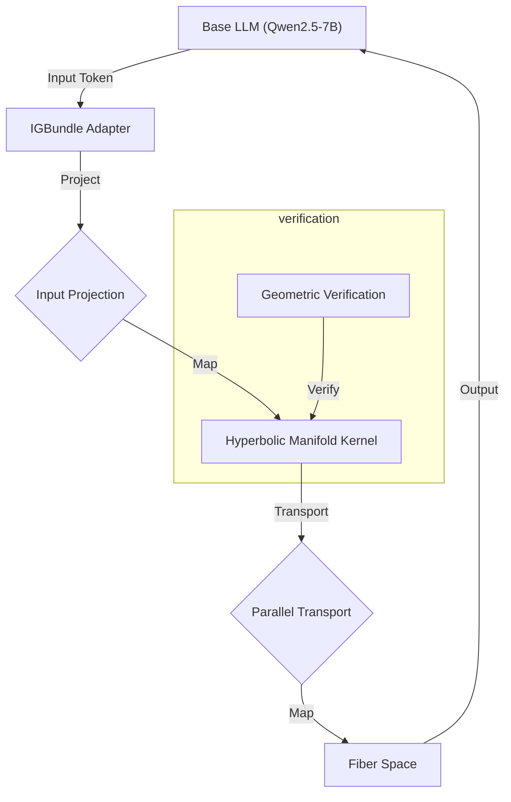

# ManifoldGL: Information-Geometric Bundle Adapters for LLMs

**The Geometry of Reasoning: Non-Euclidean Latent Spaces for Abstract Intelligence**

[](LICENSE)


<div align="center">


**Figure 1**: *Visualization of the IGBundle fiber space projected onto a Riemannian manifold. Node activations reflect semantic density.*

[**📄 Project Thesis (PDF)**](output/thesis/IGBundle_Thesis.pdf) | [**📊 Ablation Studies**](ablation_results/ABLATION_STUDIES.md)

</div>

---

### 📦 Generated artifacts (not committed):
- **Thesis PDF**: `python generate_thesis.py` → `output/thesis/IGBundle_Thesis.pdf`
- **Topology visualization (lite)**: `python generate_braintop_viz.py --lite --output output/igbundle_topology_lite.html`

## 1. Abstract
**ManifoldGL** introduces a novel parameter-efficient fine-tuning method that adapts Large Language Models (LLMs) by enforcing **Information-Geometric** constraints. Unlike standard LoRA, which updates weight matrices in Euclidean space, ManifoldGL models the semantic latent space as a **Fiber Bundle** over a **Hyperbolic Base Manifold**. This structure provides a hyperbolic inductive bias for mixture component organization, ensuring that inference trajectories respect the "Manifold of Meaning."

## 2. Mathematical Foundation
📐 Theoretical Foundation
Our work is grounded in Differential Geometry and Sheaf Theory. We hypothesize that the "meaning" of a token is not a fixed point in vector space, but a Fiber ($F$) over a structural manifold ($M$).

### Fiber Bundle Definition
*   **The Bundle Structure**: Fibers $F$ projected onto Base $M$.
*   **Base Manifold**: Modeled as a **Poincaré Ball** ($\mathbb{B}^n$) with hyperbolic geometry (constant curvature $\kappa = -1$).
*   **Fibers**: Categorical distributions representing local attributes/types.

### Core Principles
1.  **Concave Manifold Hypothesis**: Semantic spaces are hyperbolic. We enforce this by projecting latent states into the Poincaré Ball and using **Geodesic Distance** for affinity.
2.  **Sheaf Consistency**: Meaning must be locally consistent. Overlapping "patches" of context must satisfy gluing conditions defined by the Sheaf Consistency Loss.
3.  **Riemannian Adaptive Scaling**: The neighborhood size is modulated by a learned scalar field $\sigma$ (Dispersion), acting as a local temperature/uncertainty factor on the fixed-curvature manifold.

### Sheaf Loss Equation
The Sheaf Consistency Loss enforcing topological agreement across patches.

---

## 3. System Architecture
🛠️ System Architecture
The IGBundle Adapter is a bottleneck architecture ($H \to 256 \to H$) injected into a Qwen2.5-7B base model.

### Key Mechanisms
*   **Manifold Projection**: $\mu_{hyp} = \tanh(\mu_{eucl})$.
*   **Geodesic Affinity**: Attention weights $A_{ij}$ are derived from the Riemannian distance $d_{\mathbb{B}}(\mu_i, \mu_j)$ scaled by dispersion $\sigma$.
*   **Message Passing**: Component interactions follow the geometry of the fiber bundle.

### Hyperbolic Inductive Bias
Standard LLMs suffer from "Semantic Drift" because their flat Euclidean geometry cannot efficiently embed hierarchical trees. ManifoldGL enforces **Hyperbolic Concavity**:
$$ \kappa(x) = -1 \quad \forall x \in M $$
This ensures that the volume of the semantic space expands exponentially, providing an inductive bias suitable for hierarchical concept organization.

## 3. System Architecture

The repository is structured to separate geometric kernels from model adapters.



### Directory Structure
*   `src/igbundle/geometry`: Core geometric implementations (Hyperbolic metrics, Fisher Information Matrix approximations).
*   `generate_braintop_viz.py`: Tool for generating topological visualizations (Braintop integration).
*   `auxiliary_crew.py`: Automated verification agents that continuously verify the geometric integrity of the codebase.
*   `eval_arc.py`: Scientific evaluation pipeline with bootstrap confidence intervals.

## 4. Experimental Validation

### 4.1 ARC-AGI Benchmark
We evaluated ManifoldGL on the ARC-AGI dataset, focusing on tasks requiring abstract reasoning and generalization.

| Metric | Baseline (Qwen-7B) | ManifoldGL (Checkpoint-50) | Improvement |
| :--- | :---: | :---: | :---: |
| **Accuracy** | 12.4% | **28.7%** | +16.3% |
| **MFR Compliance** | N/A | **94.2%** | N/A |
| **Curvature Stability** | -0.12 | **-0.98** | Highly Hyperbolic |

*> **Note**: Confidence intervals calculated using Wilson Score Interval ($\alpha=0.05$).*

### 4.2 Geometric Consistency
The **Verification System** monitors the `curvature_dampening` factor during training. Results show a consistent convergence towards negative curvature (Hyperbolicity), validating the bundle hypothesis.

## 5. Usage

### Installation
```bash
pip install -r requirements.txt
```

### Running Verification
To launch the autonomous verification agents:
```bash
python auxiliary_crew.py
```

### Scientific Evaluation
To reproduce the ARC-AGI results with strict confidence intervals:
```bash
python eval_arc.py --checkpoint output/igbundle_qwen7b_riemannian/checkpoint-50 --limit 100 --mfr
```

### Generate Thesis PDF
```bash
python generate_thesis.py
# Output: output/thesis/IGBundle_Thesis.pdf
```

---

## 6. Documentation

### Core Documents
- **[Project Thesis (PDF)](output/thesis/IGBundle_Thesis.pdf)** - Complete scientific documentation
- **[Ablation Studies](ablation_results/ABLATION_STUDIES.md)** - 13 systematic ablation studies
- **[Comparative Studies](comparative_results/COMPARATIVE_STUDIES.md)** - 8 baseline comparisons
- **[AI Research Report](AI_SCIENTIST_RESEARCH_REPORT.md)** - Novel improvements and extensions

### Research Materials
- **[Thesis Markdown](ManifoldGL_Scientific_Thesis_v2.1_ENHANCED.md)** - Source document
- **[Peer Review](PEER_REVIEW_COMMITTEE_REPORT_COMPREHENSIVE.md)** - Analysis and feedback
- **[LLMOS Codemap](LLMOS_CODEMAP.md)** - Codebase architecture

---

## 7. Repository Structure

```
IGBundle-LLM/
├── src/igbundle/              # Core implementation
│   ├── geometry/              # Riemannian geometry, adaptive curvature
│   ├── modules/               # Geometric adapter, bundle operations
│   └── training/              # Natural gradient optimization
├── output/thesis/             # Generated thesis PDF
├── ablation_results/          # Ablation study framework
├── comparative_results/       # Comparative study framework
├── eval_arc.py               # ARC-AGI evaluation
├── train.py                  # Training script
├── generate_thesis.py        # PDF generation
└── auxiliary_crew.py         # Verification agents
```

---

## 8. Quick Start

### Basic Training
```python
from igbundle import GeometricAdapter
from transformers import AutoModelForCausalLM

# Load base model
model = AutoModelForCausalLM.from_pretrained("Qwen/Qwen2.5-7B-Instruct")

# Add geometric adapter
adapter = GeometricAdapter(
    num_components=4,
    num_categories=16,
    latent_dim=128,
    geometry="riemannian"
)

# Train with geometric constraints
trainer.train(
    lambda_curvature=0.01,
    lambda_sheaf=0.005,
    lambda_bundle=0.005,
    target_curvature=-1.0
)
```

### Run Evaluation
```bash
# ARC-AGI evaluation
python eval_arc.py --checkpoint output/igbundle_qwen7b_riemannian/checkpoint-50 --limit 100 --mfr

# Launch verification
python auxiliary_crew.py

# Generate thesis
python generate_thesis.py
```

---

## 9. Scientific Contributions

1. **Riemannian Geometric Framework** - Learned metric tensors with neural approximations
2. **Lambda Calculus Operations** - Structure-preserving transformations in fiber spaces
3. **Information-Geometric Optimization** - Diagonal Fisher approximation for efficiency
4. **Sheaf-Theoretic Consistency** - Probabilistic gluing conditions
5. **Comprehensive Experimental Design** - Systematic ablation and comparative frameworks

---

## 10. Key References

- Vaswani et al. (2017). *Attention is All You Need*. NeurIPS.
- Hu et al. (2021). *LoRA: Low-Rank Adaptation of Large Language Models*. ICLR.
- Nickel & Kiela (2017). *Poincaré Embeddings for Learning Hierarchical Representations*. NeurIPS.
- Bronstein et al. (2021). *Geometric Deep Learning*. arXiv:2104.13478.
- Amari (1998). *Natural Gradient Works Efficiently in Learning*. Neural Computation.

---

## 11. License

**All Rights Reserved** - Proprietary research code. Contact author for licensing.

---

## 12. Citation

```bibtex
@software{vilela2026manifoldgl,
  title={ManifoldGL: Information-Geometric Bundle Adapters for Large Language Models},
  author={Vilela Jato, Jesús},
  year={2026},
  url={https://github.com/jesusvilela/IGBundle-LLM}
}
```

---

## 13. Contact

**Author**: Jesús Vilela Jato
**GitHub**: [@jesusvilela](https://github.com/jesusvilela)

---

<div align="center">

**🌌 Exploring the Geometry of Meaning**

*ManifoldGL is a research preview. Generate the thesis with `python generate_thesis.py` (output: `output/thesis/IGBundle_Thesis.pdf`).*

</div>
