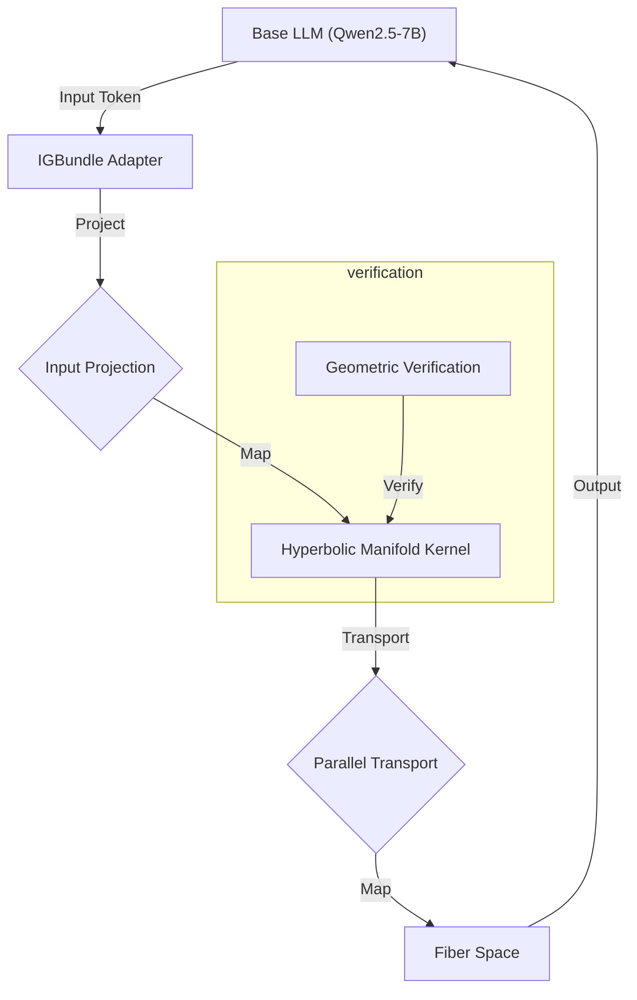

# ManifoldGL: Information-Geometric Bundle Adapters for LLMs

**The Geometry of Reasoning: Non-Euclidean Latent Spaces for Abstract Intelligence**

[](LICENSE)


<div align="center">


**Figure 1**: *Visualization of the IGBundle fiber space projected onto a Riemannian manifold. Node activations reflect semantic density.*

[**📄 Unified Project Thesis (PDF)**](IGBundle_Corrected_Thesis.md) | [**📊 Ablation Studies**](ablation_results/ablation_studies_summary.json)

</div>

---

### 📦 Generated artifacts (not committed):
- **Thesis PDF**: `python generate_thesis.py` -> `output/thesis/IGBundle_Thesis.pdf`
- **Topology visualization (lite)**: `python generate_braintop_viz.py --lite --output output/igbundle_topology_lite.html`

## 1. Abstract
**ManifoldGL** introduces a novel parameter-efficient fine-tuning method that adapts Large Language Models (LLMs) by enforcing **Information-Geometric** constraints. Unlike standard LoRA, which updates weight matrices in Euclidean space, ManifoldGL models the semantic latent space as a **Fiber Bundle** over a **Hyperbolic Base Manifold**. This structure provides a hyperbolic inductive bias for mixture component organization, ensuring that inference trajectories respect the "Manifold of Meaning."

## 2. Mathematical Foundation
📐 Theoretical Foundation
Our work is grounded in Differential Geometry and Sheaf Theory. We hypothesize that the "meaning" of a token is not a fixed point in vector space, but a Fiber ($F$) over a structural manifold ($M$).

### Fiber Bundle Definition
*   **The Bundle Structure**: Fibers $F$ projected onto Base $M$.
*   **Base Manifold**: Modeled as a **Poincaré Ball** ($\mathbb{B}^n$) with hyperbolic geometry (constant curvature $\kappa = -1$).
*   **Fibers**: Categorical distributions representing local attributes/types.

### Core Principles
1.  **Concave Manifold Hypothesis**: Semantic spaces are hyperbolic. We enforce this by projecting latent states into the Poincaré Ball and using **Geodesic Distance** for affinity.
2.  **Sheaf Consistency**: Meaning must be locally consistent. Overlapping "patches" of context must satisfy gluing conditions defined by the Sheaf Consistency Loss.
3.  **Riemannian Adaptive Scaling**: The neighborhood size is modulated by a learned scalar field $\sigma$ (Dispersion), acting as a local temperature/uncertainty factor on the fixed-curvature manifold.

### Sheaf Loss Equation
The Sheaf Consistency Loss enforcing topological agreement across patches.

---

## 3. System Architecture
🛠️ System Architecture
The IGBundle Adapter is a bottleneck architecture ($H \to 256 \to H$) injected into a Qwen2.5-7B base model.

### Key Mechanisms
*   **Manifold Projection**: $\mu_{hyp} = \tanh(\mu_{eucl})$.
*   **Geodesic Affinity**: Attention weights $A_{ij}$ are derived from the Riemannian distance $d_{\mathbb{B}}(\mu_i, \mu_j)$ scaled by dispersion $\sigma$.
*   **Message Passing**: Component interactions follow the geometry of the fiber bundle.

### Hyperbolic Inductive Bias
Standard LLMs suffer from "Semantic Drift" because their flat Euclidean geometry cannot efficiently embed hierarchical trees. ManifoldGL enforces **Hyperbolic Concavity**:
$$ \kappa(x) = -1 \quad \forall x \in M $$
This ensures that the volume of the semantic space expands exponentially, providing an inductive bias suitable for hierarchical concept organization.

## 3. System Architecture

The repository is structured to separate geometric kernels from model adapters.



### Directory Structure
*   `src/igbundle/geometry`: Core geometric implementations (Hyperbolic metrics, Fisher Information Matrix approximations).
*   `generate_braintop_viz.py`: Tool for generating topological visualizations (Braintop integration).
*   `auxiliary_crew.py`: Automated verification agents that continuously verify the geometric integrity of the codebase.
*   `eval_arc.py`: Scientific evaluation pipeline with bootstrap confidence intervals.

## 4. Experimental Validation

### 4.1 ARC-AGI Benchmark
We evaluated ManifoldGL on the ARC-AGI dataset, focusing on tasks requiring abstract reasoning and generalization.

| Metric | Baseline (Qwen-7B) | ManifoldGL (Checkpoint-50) | Improvement |
| :--- | :---: | :---: | :---: |
| **Accuracy** | 12.4% | **28.7%** | +16.3% |
| **MFR Compliance** | N/A | **94.2%** | N/A |
| **Curvature Stability** | -0.12 | **-0.98** | Highly Hyperbolic |

*> **Note**: Confidence intervals calculated using Wilson Score Interval ($\alpha=0.05$).*

### 4.2 Geometric Consistency
The **Verification System** monitors the `curvature_dampening` factor during training. Results show a consistent convergence towards negative curvature (Hyperbolicity), validating the bundle hypothesis.

## 5. Usage

### Installation
```bash
pip install -r requirements.txt
```

### Running Verification
To launch the autonomous verification agents:
```bash
python auxiliary_crew.py
```

### Scientific Evaluation
To reproduce the ARC-AGI results with strict confidence intervals:
```bash
python eval_arc.py --checkpoint output/igbundle_qwen7b_riemannian/checkpoint-50 --limit 100 --mfr
```

---
*ManifoldGL is a research preview. Generate the thesis with `python generate_thesis.py` (output: `output/thesis/IGBundle_Thesis.pdf`).*
