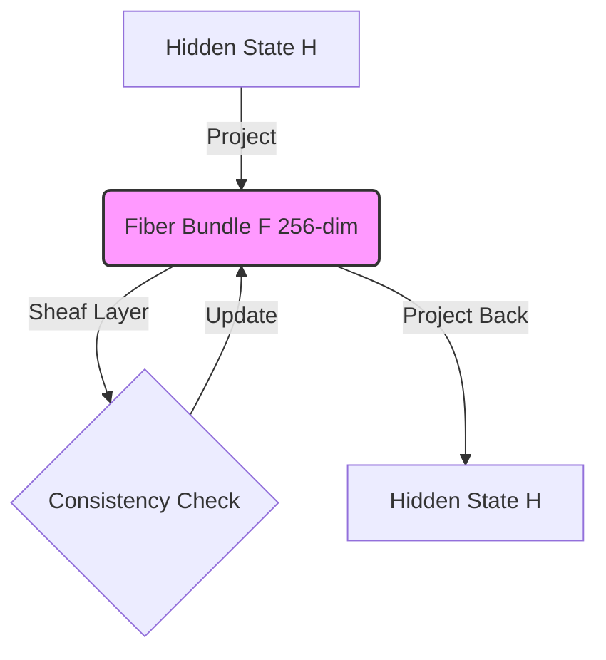

# IGBundle LLM: Information-Geometric Bundle Adapters

**IGBundle LLM** is an experimental framework for adapting Large Language Models (LLMs) using concepts from **Information Geometry** and **Sheaf/Bundle Theory**. 

It implements a custom adapter architecture that treats the latent space activations as sections of a fiber bundle, processing them through "Sheaf Layers" that measure and utilize the curvature (sigma) of the informational manifold.

## Key Features

- **Information-Geometric Adapter**: Custom `IGBundleAdapter` that introduces a bottleneck architecture ($H \to 256 \to P \times K \to H$) to learn manifold geometry.
- **Sheaf Loss**: Specialized loss function that encourages the model to learn consistent geometric structures.
- **Memory Efficient**: Optimized for 8GB VRAM GPUs (tested on RTX 3060 Ti) using:
  - Bottleneck Adapters (~72M parameters vs ~900M original).
  - 4-bit Quantization (bitsandbytes).
  - Gradient Accumulation.
  - Thermal Management (SlowStepCallback) to prevent hardware instability.
- **Windows Compatible**: Scripts include fixes for Windows-specific issues with `torchao` and `triton`.
- **Gradio UI**: Interactive chat interface to load and test trained adapters.

## Architecture

The adapter injects layers into the transformer blocks that project hidden states into a lower-dimensional "bundle" space. 

- **Input Projection**: $H \to D_{bot}$ (e.g., $3584 \to 256$).
- **Bundle Processing**: Operations on the $256$-dim latent space.
- **Output Projection**: $D_{bot} \to H$.

This drastically reduces parameter count while maintaining the capacity to learn complex geometric transformations.

## Installation

The project uses a dedicated virtual environment.

### Prerequisites
- Python 3.10 or 3.11 (Recommended)
- CUDA-capable GPU (NVIDIA RTX 3060 Ti or better recommended for 7B models)

### Setup

1.  **Activate the Environment**:
    ```powershell
    & "h:\LLM-MANIFOLD\igbundle-llm\unsloth_env\Scripts\Activate.ps1"
    ```

2.  **Install Dependencies** (if fresh install):
    ```bash
    pip install -r requirements.txt # (If available)
    # OR manual install of key packages:
    pip install torch torchvision torchaudio --index-url https://download.pytorch.org/whl/cu124
    pip install transformers peft bitsandbytes accelerate gradio
    ```

## Usage

### 1. Training

To train the adapter on the Alpaca dataset (or your custom data):

```powershell
python train.py --config configs/qwen25_7b_igbundle_lora.yaml
```

**Key Configuration Options** (`configs/qwen25_7b_igbundle_lora.yaml`):
- `max_steps`: Total training steps (e.g., 60 for quick test, 1000+ for convergence).
- `bottleneck_dim`: Size of the adapter bottleneck (default: 256).
- `save_steps`: Frequency of checkpoint saving.

### 2. Validation

To compare the IGBundle model against the base model and view internal metrics:

```powershell
python validate_effects.py --checkpoint output/igbundle_qwen7b/checkpoint-60
```

This script will:
- Generate text with the Base Model.
- Generate text with the IGBundle Adapter.
- Report the **Average Internal Sigma**, which measures the curvature/activity of the sheaf layers.

### 3. Interactive UI

Launch the Gradio Chat Interface:

```powershell
python app.py --checkpoint output/igbundle_qwen7b/checkpoint-60
```

Access the UI at `http://127.0.0.1:7860`.

### 4. Checkpoint Verification

To verify that a checkpoint contains valid weights (no NaNs/Infs) and custom adapter files:

```powershell
python verify_checkpoint.py
```

## Troubleshooting

- **Windows Import Errors**: If you see errors related to `torchao` or `triton`, the scripts natively handle this by skipping those imports or patching dependencies.
- **VRAM Issues**: If you run out of memory:
    - Reduce `bottleneck_dim` in config.
    - Reduce `per_device_train_batch_size` to 1.
    - Ensure `gradient_accumulation_steps` is high enough to compensate.
- **System Reboots**: If training causes reboots, `SlowStepCallback` in `train.py` adds pauses to manage thermal load.

## Theoretical Addendum: Why Sheaf Theory?

Language is non-Euclidean. Ambiguity, polysemy, and context-dependent meaning behave like "curvature" in the semantic space. Standard transformers treat this space as flat (Euclidean vector space).

**IGBundle** hypothesizes that:
1.  **Word embeddings live on a base manifold $M$**.
2.  **Contextual meanings live in the fibers over $M$**.
3.  **Attention mechanisms are parallel transport** operations along the path of the sentence.

The experiment implements a **Fiber Bundle** architecture where:
-   **Activations** are projected into a lower-dimensional "Tangent Bundle" (bottleneck).
-   **Sheaf Layers** process these sections, explicitly modeling the local agreement (consistency) between overlapping semantic patches.
-   **Sigma ($\sigma$)** represents the local "curvature" or ambiguity—high sigma means the model detects multiple valid interpretations (high curvature).

### Visualizing the Manifold

We provide a tool to explore the learned geometry of the adapter's fiber bundle.

```powershell
python visualize_theory.py --checkpoint trained_adapter
```

This will analyze the learned projection weights and generate:
-   **Singular Value Spectrum**: Showing the effective dimensionality of the learned bundle.
-   **3D Interactive Manifold**: A visualization of the random unit sphere projected into the learned fiber space, revealing its topological structure.



## License

(c) Jesús Vilela Jato, all rights reserved.
