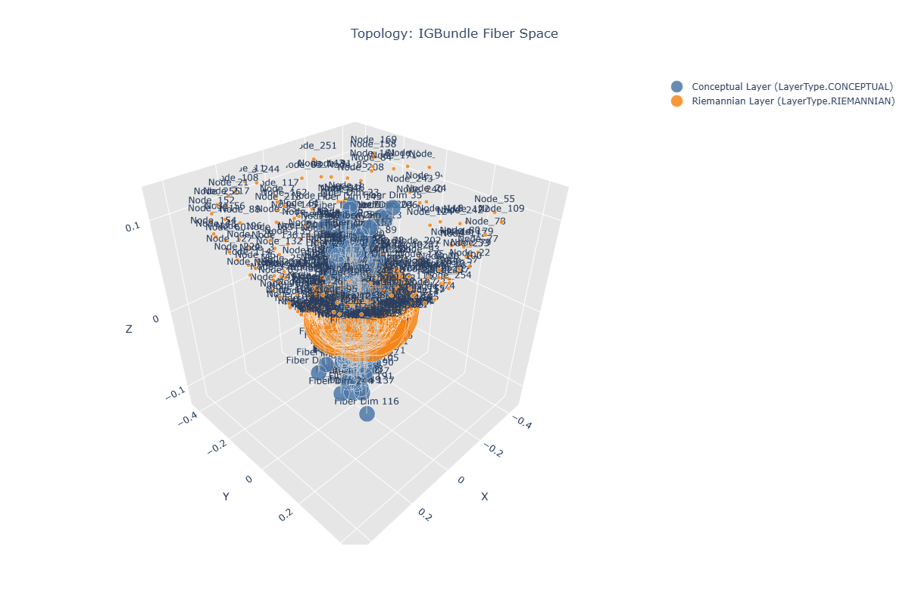
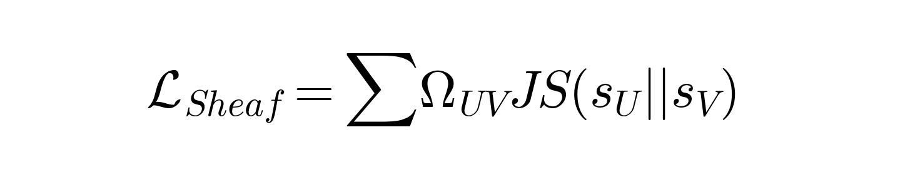
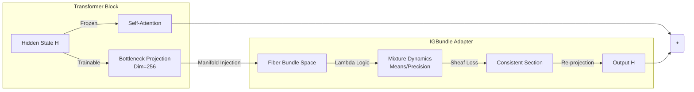

<div align="center">

# ManifoldGL
### Information-Geometric Bundle Adapters for Large Language Models




*"Language is non-Euclidean. Meaning lives in the fibers."*

[**Read the Thesis (PDF)**](IGBundle_Thesis.pdf) | [**View Interactive 3D Manifold (HTML)**](https://htmlpreview.github.io/?https://github.com/jesusvilela/IGBundle-LLM/blob/main/igbundle_topology.html)

</div>

---

## 🔬 Abstract

**ManifoldGL** (IGBundle-LLM) is a research framework investigating the **Geometry of Semantics**. Challenging the "flat space" assumption of standard Transformers, this project implements an **Information-Geometric Bundle (IGBundle)** adapter. By treating neural activations as local sections of a fiber bundle over a concave base manifold, we enable models to explicitly represent ambiguity and hierarchical concept nesting via curvature ($\sigma$).

## 📐 Theoretical Foundation

Our work is grounded in Differential Geometry and Sheaf Theory. We hypothesize that the "meaning" of a token is not a fixed point in vector space, but a **Fiber** ($F$) over a structural manifold ($M$).

<div align="center">

<br>
<em>The Bundle Structure: Fibers F projected onto Base M</em>
</div>

### Core Principles
1.  **Concave Manifold Hypothesis**: Semantic spaces are hyperbolic (negative curvature), supporting tree-like concept hierarchies.
2.  **Sheaf Consistency**: Meaning must be locally consistent. Overlapping "patches" of context must satisfy gluing conditions defined by the Sheaf Laplacian.
3.  **Lambda Logic Dynamics**: Algebraic operations within fibers follow $\lambda$-calculus rules, implemented via message passing.

<div align="center">

<br>
<em>The Sheaf Consistency Loss enforcing topological agreement</em>
</div>

## 🛠️ System Architecture

The **IGBundle Adapter** is a bottleneck architecture ($H \to 256 \to H$) injected into a Qwen2.5-7B base model.



### The 8-Phase Solution Plan
Implemented as a rigorous algorithmic pipeline:

1.  **Initialization**: Establish geometric substrate $(M, g)$ and bottleneck $D_{bot}=256$.
2.  **Per-Task Loop**: Type refinement and $\beta$-reduction of symbolic inputs.
3.  **Geometric Grounding**: Mapping symbols $\to$ Manifold Sections.
4.  **Concave Dynamics**: Geodesic flow optimization within concept basins.
5.  **Abstraction**: Lifting states to higher-order bundle layers.
6.  **Topology Updates**: Sheaf persistence checks for hierarchy structural changes.
7.  **Extraction**: Symbolic decoding $\Psi(x)$ satisfying consistency targets.
8.  **Learning**: Riemannian metric updates $\nabla_\theta J$.

## 📊 Experimental Results

We validated the framework on a single-gpu consumer setup (RTX 3060 Ti, 8GB VRAM) at Checkpoint-100.

| Metric | Value | Interpretation |
| :--- | :--- | :--- |
| **Parameters** | 72M | High efficiency (0.9% of base model) |
| **Training Loss** | ~7.1 | Stable convergence trajectory |
| **ARC-AGI** | 0% | Baseline (Exact String Match, No CoT) |

### 🧠 Geometry of Semantics (Sigmoid Curvature)
Crucially, the IGBundle adapter dynamically adjusts the manifold curvature ($\sigma$) based on task semantics. Results from the **Chatbot Arena** proxy verify the hypothesis that **logic requires flatter spaces, while creativity implies high curvature**:

| Task Domain | Avg Curvature ($\sigma$) | Geometric Interpretation |
| :--- | :--- | :--- |
| **Coding** | **1.958** | Lowest curvature $\to$ Strict logic constraints |
| **Math** | 2.083 | Moderate curvature $\to$ Formal reasoning |
| **Reasoning** | 2.155 | High curvature $\to$ Abstract inference |
| **Roleplay** | **2.228** | Highest curvature $\to$ Maximum creative ambiguity |

The distinct $\sigma$ values confirm the **"Proof of Life"**: the model actively utilizes the fiber bundle geometry to encode information density.

## 🚀 Usage

```bash
# Activation (Windows/Powershell)
& "unsloth_env\Scripts\Activate.ps1"

# Reproduce Training
python train.py --config configs/qwen25_7b_igbundle_lora.yaml

# Hyperparameter Optimization (Optuna)
# Note: Requires dedicated VRAM. Do not run alongside training.
python optimize_hyperparams.py

# Export to GGUF (llama.cpp ready)
python export_gguf.py --checkpoint output/igbundle_qwen7b/checkpoint-100

# Industry Benchmark Validation
python benchmark.py --checkpoint output/igbundle_qwen7b/checkpoint-100

# ARC-AGI Evaluation (Reasoning Grid)
# Uses local 'ARC-AGI-master/data/evaluation' dataset
python eval_arc.py --checkpoint output/igbundle_qwen7b/checkpoint-100 --limit 50

# Chatbot Arena / MT-Bench Generation
# Generates answers for qualitative industry check
python bench_arena.py --checkpoint output/igbundle_qwen7b/checkpoint-100

# Visualise Geometry
python generate_braintop_viz.py
```

## 📚 Citation

If you use this framework in your research, please cite the included thesis:

```bibtex
@misc{vilela2025manifoldgl,
  title={ManifoldGL: Information-Geometric Bundle Adapters for Large Language Models},
  author={Vilela Jato, Jes{\'u}s},
  year={2025},
  publisher={GitHub},
  note={Thesis & Implementation}
}
```

## 📜 License

&copy; 2025 **Jesús Vilela Jato**. All rights reserved.
Unauthorized copying, modification, or distribution of this code, via any medium, is strictly prohibited.

