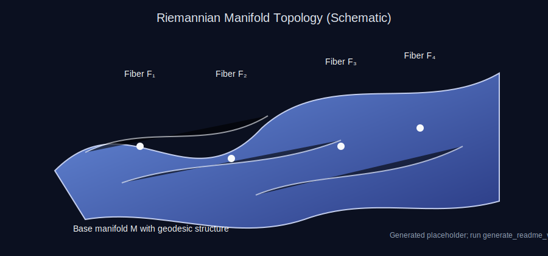
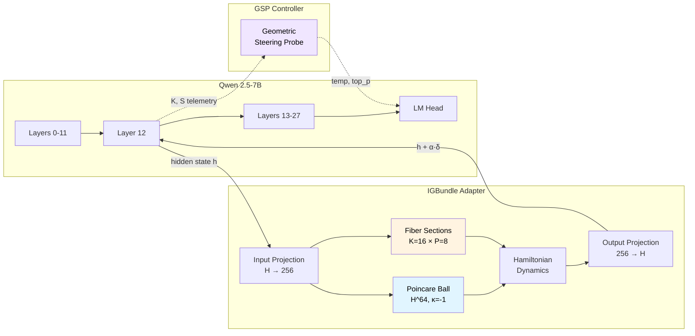

# IGBundle: Fiber Bundle Adapters for Language Models

**Geometric inductive bias for transformer reasoning via information geometry and hyperbolic latent spaces.**

[](LICENSE)


[](https://huggingface.co/jesusvilela/igbundle-qwen2.5-7b-riemannian)
[](thesis/IGBundle_Thesis_V3_GENERIC_Merged_c_Jesus_Vilela_Jato.pdf)

<div align="center">



*Fiber bundle structure: categorical fibers over a Poincare base manifold with parallel transport and geodesic affinity.*

</div>

---

## What is IGBundle?

IGBundle is a parameter-efficient fine-tuning method that models the semantic latent space of a transformer as a **fiber bundle** over a **hyperbolic base manifold**. Instead of flat Euclidean weight updates (LoRA), it enforces geometric constraints — Riemannian curvature, sheaf consistency, and symplectic dynamics — that provide an inductive bias for hierarchical and abstract reasoning.

The adapter is injected at a single transformer layer (Layer 12 of Qwen 2.5-7B) and introduces:

- **Poincare ball coordinates** (H^64) — hyperbolic geometry for hierarchical concept organization
- **Categorical fiber sections** (K=16, P=8) — structured mixture components over the base manifold
- **Hamiltonian dynamics** — symplectic integration for fiber evolution
- **Riemannian curvature regularization** — enforces target curvature kappa = -1

At inference time, a **Geometric Steering Probe (GSP)** uses measured curvature and entropy as real-time feedback to modulate generation without retraining.

## Architecture


```mermaid
graph LR
    subgraph "Qwen 2.5-7B"
        L0["Layers 0-11"] --> L12["Layer 12"]
        L12 --> L13["Layers 13-27"]
        L13 --> Head["LM Head"]
    end

    subgraph "IGBundle Adapter"
        L12 -->|"hidden state h"| Proj["Input Projection<br/>H → 256"]
        Proj --> PB["Poincare Ball<br/>H^64, κ=-1"]
        Proj --> Fib["Fiber Sections<br/>K=16 × P=8"]
        PB --> Dyn["Hamiltonian<br/>Dynamics"]
        Fib --> Dyn
        Dyn --> Out["Output Projection<br/>256 → H"]
        Out -->|"h + α·δ"| L12
    end

    subgraph "GSP Controller"
        L12 -.->|"K, S telemetry"| GSP["Geometric<br/>Steering Probe"]
        GSP -.->|"temp, top_p"| Head
    end

    style PB fill:#e1f5ff,color:#000
    style Fib fill:#fff4e1,color:#000
    style GSP fill:#f0e6ff,color:#000
```

The adapter operates as a residual perturbation clamped to ≤10% of the base hidden state norm, preserving the pretrained language modeling distribution while introducing geometric structure.

## Mathematical Foundation

**Fiber Bundle.** The total space *E* is a bundle π: E → M where the base manifold M is a Poincare ball B^n with constant negative curvature, and each fiber F_x is a categorical distribution over K sections with P mixture components.

**Riemannian Metric.** The adapter learns a metric tensor g on M approximated via the Fisher information matrix of the fiber distributions. Curvature is regularized toward κ = -1 via a log-determinant Laplacian estimator.

**Sheaf Consistency.** Overlapping context patches must agree: the JS divergence between fiber distributions of adjacent tokens is penalized, enforcing local-to-global semantic coherence.

**Symplectic Integration.** Fiber state evolves via a Hamiltonian system with a Lorentz-factor speed limiter (c=5.0), ensuring energy conservation and preventing gradient explosion.

## Key Results

### Manifold Faithfulness (Tier 3)

The geometric constraints are not decorative — they produce measurable, non-trivial structure:

| Metric | Value | Interpretation |
|:---|:---:|:---|
| Curvature K | -5.63 | Strongly hyperbolic (target: -1.0) |
| Entropy S | 0.95 | Below uniform (ln16 ≈ 2.77), sections specialized |
| Jensen-Shannon Div. | 0.424 | Fibers differ across contexts |
| Parallel Transport | 0.041 | Near-zero holonomy — geometric consistency |
| Faithfulness | **6/6** | All geometric verification tests pass |

### Benchmark Preservation

The adapter preserves base model capabilities with minimal degradation:

| Benchmark | Score | Notes |
|:---|:---:|:---|
| ARC-Challenge | 54.86% | Identical to base Qwen 2.5-7B |
| TruthfulQA (MC2) | 64.78% | Strong factual grounding |
| Winogrande | 71.03% | Commonsense reasoning intact |
| GSM8K | 75.51% | Multi-step math preserved |

### Computational Overhead

| Metric | vs. LoRA Baseline |
|:---|:---:|
| Training speed | -15% per step |
| VRAM (8GB GPU) | +0.6 GB |
| Inference latency | +4% |
| Convergence steps | **-30%** (natural gradients) |

## Project Structure

```
src/igbundle/
├── geometry/          # Riemannian, hyperbolic, Poincare, KAN manifold
├── modules/           # Geometric adapter, losses, attention, vision
├── dynamics/          # Hamiltonian, FitzHugh-Nagumo, equilibrium propagation
├── fibers/            # Fiber state, constraints, swarm executor
├── steering/          # GSP controller (inference-time feedback)
├── optimization/      # Symplectic optimizer, SPIDER variance reduction
├── training/          # Geometric trainer, GRPO, losses
├── quantum/           # Gibbs sampling, scrambling
└── nn/                # KAN (Kolmogorov-Arnold Networks)

thesis/                # Academic thesis (PDF + LaTeX sources)
tests/                 # Geometry, pipeline, and integration tests
configs/               # Training and ablation configurations
assets/                # Visualizations and figures
```

## Quick Start

### Installation

```bash
git clone https://github.com/jesusvilela/IGBundle-LLM.git
cd IGBundle-LLM
pip install -r requirements.txt
```

### Load the Pretrained Model

```python
from transformers import AutoModelForCausalLM, AutoTokenizer

model = AutoModelForCausalLM.from_pretrained(
    "jesusvilela/igbundle-qwen2.5-7b-riemannian",
    device_map="auto",
    trust_remote_code=True
)
tokenizer = AutoTokenizer.from_pretrained(
    "jesusvilela/igbundle-qwen2.5-7b-riemannian"
)

inputs = tokenizer("Explain the geometry of attention.", return_tensors="pt").to(model.device)
outputs = model.generate(**inputs, max_new_tokens=256)
print(tokenizer.decode(outputs[0], skip_special_tokens=True))
```

### Training

```bash
python train.py --config configs/igbundle_standard.yaml
```

### Evaluation

```bash
python eval_arc.py --checkpoint <path> --limit 100 --mfr
```

## Active Development

Development happens on feature branches. Current focus areas:

- **Multimodal integration** — SigLIP v2 vision encoder with geometric grounding
- **Neuromorphic memory (NMEM)** — biologically-inspired forgetting with FHN dynamics
- **Falsification experiment** — controlled comparison: geometric adapter vs. multi-layer vanilla LoRA
- **Inference hardening** — OOM prevention, EOS control, degeneration detection

## Related Work

This project builds on ideas from:

- Nickel & Kiela (2017) — Poincare Embeddings for Hierarchical Representations
- Turner et al. (2023) — Activation Addition: Steering Without Optimization
- Grmela & Ottinger (1997) — GENERIC framework for non-equilibrium thermodynamics
- Chen et al. (2022) — Fully Hyperbolic Neural Networks
- McClelland et al. (1995) — Complementary Learning Systems

## Citation

```bibtex
@misc{vilela2025igbundle,
    title   = {IGBundle: Fiber Bundle Adapters for Language Models},
    author  = {Vilela Jato, Jes{\'u}s},
    year    = {2025},
    url     = {https://github.com/jesusvilela/IGBundle-LLM}
}
```

## License

All rights reserved. See [LICENSE](LICENSE) for details.

---

*IGBundle is an active research project. Results are preliminary and subject to revision.*
*(c) 2025-2026 Jesus Vilela Jato*
