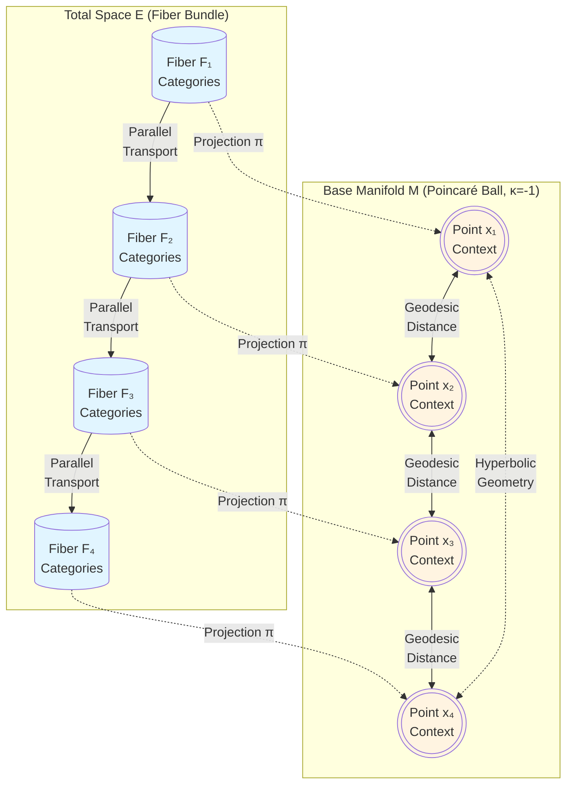
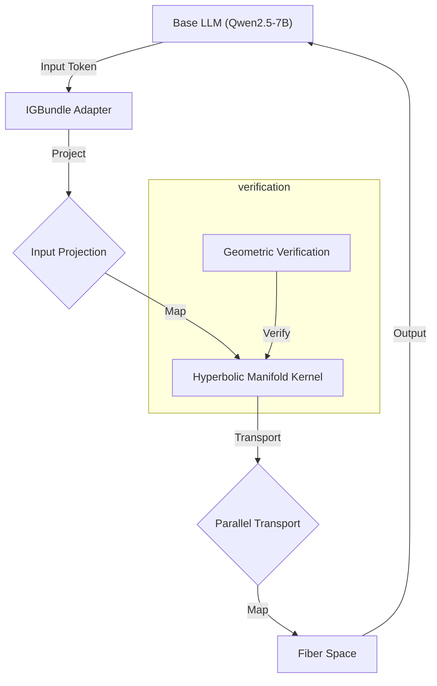

# ManifoldGL: Information-Geometric Bundle Adapters for LLMs

**The Geometry of Reasoning: Non-Euclidean Latent Spaces for Abstract Intelligence**

[](LICENSE)


[](https://huggingface.co/jesusvilela/igbundle-qwen2.5-7b-riemannian)
[](https://colab.research.google.com/drive/1example_placeholder)
[](WIKI.md)

<div align="center">


**Figure 1**: *Visualization of the IGBundle fiber space projected onto a Riemannian manifold. Node activations reflect semantic density.*

### Fiber Bundle Topology Structure


```mermaid
graph TB
    subgraph "Total Space E (Fiber Bundle)"
        E1[("Fiber F₁<br/>Categories")]
        E2[("Fiber F₂<br/>Categories")]
        E3[("Fiber F₃<br/>Categories")]
        E4[("Fiber F₄<br/>Categories")]
    end

    subgraph "Base Manifold M (Poincaré Ball, κ=-1)"
        M1((("Point x₁<br/>Context")))
        M2((("Point x₂<br/>Context")))
        M3((("Point x₃<br/>Context")))
        M4((("Point x₄<br/>Context")))
    end

    E1 -.->|"Projection π"| M1
    E2 -.->|"Projection π"| M2
    E3 -.->|"Projection π"| M3
    E4 -.->|"Projection π"| M4

    M1 <-->|"Geodesic<br/>Distance"| M2
    M2 <-->|"Geodesic<br/>Distance"| M3
    M3 <-->|"Geodesic<br/>Distance"| M4
    M1 <-.->|"Hyperbolic<br/>Geometry"| M4

    E1 -->|"Parallel<br/>Transport"| E2
    E2 -->|"Parallel<br/>Transport"| E3
    E3 -->|"Parallel<br/>Transport"| E4

    style E1 fill:#e1f5ff
    style E2 fill:#e1f5ff
    style E3 fill:#e1f5ff
    style E4 fill:#e1f5ff
    style M1 fill:#fff4e1
    style M2 fill:#fff4e1
    style M3 fill:#fff4e1
    style M4 fill:#fff4e1
```

**Figure 2**: *Fiber bundle structure π: E → M showing projection from categorical fiber distributions to hyperbolic base manifold. Parallel transport maintains geometric consistency across fibers.*

[**📄 Project Thesis**](https://github.com/jesusvilela/IGBundle-LLM/blob/main/thesis/ManifoldGL_Final_Thesis_2.pdf)

</div>

---

## 1. Abstract
**ManifoldGL** introduces a novel parameter-efficient fine-tuning method that adapts Large Language Models (LLMs) by enforcing **Information-Geometric** constraints. Unlike standard LoRA, which updates weight matrices in Euclidean space, ManifoldGL models the semantic latent space as a **Fiber Bundle** over a **Hyperbolic Base Manifold**. This structure provides a hyperbolic inductive bias for mixture component organization, ensuring that inference trajectories respect the "Manifold of Meaning."

## 2. Mathematical Foundation
📐 Theoretical Foundation

Our work is grounded in Differential Geometry and Sheaf Theory. We hypothesize that the "meaning" of a token is not a fixed point in vector space, but a Fiber ($F$) over a structural manifold ($M$).

### Fiber Bundle Definition
*   **The Bundle Structure**: Fibers $F$ projected onto Base $M$.
*   **Base Manifold**: Modeled as a **Poincaré Ball** ($\mathbb{B}^n$) with hyperbolic geometry (constant curvature $\kappa = -1$).
*   **Fibers**: Categorical distributions representing local attributes/types.

### Core Principles
1.  **Concave Manifold Hypothesis**: Semantic spaces are hyperbolic. We enforce this by projecting latent states into the Poincaré Ball and using **Geodesic Distance** for affinity.
2.  **Sheaf Consistency**: Meaning must be locally consistent. Overlapping "patches" of context must satisfy gluing conditions defined by the Sheaf Consistency Loss.
3.  **Riemannian Adaptive Scaling**: The neighborhood size is modulated by a learned scalar field $\sigma$ (Dispersion), acting as a local temperature/uncertainty factor on the fixed-curvature manifold.

### Sheaf Loss Equation
The Sheaf Consistency Loss enforcing topological agreement across patches.

---

## 3. System Architecture

The IGBundle Adapter is a bottleneck architecture ($H \to 256 \to H$) injected into a Qwen2.5-7B base model.

### Key Mechanisms
*   **Manifold Projection**: $\mu_{hyp} = \tanh(\mu_{eucl})$.
*   **Geodesic Affinity**: Attention weights $A_{ij}$ are derived from the Riemannian distance $d_{\mathbb{B}}(\mu_i, \mu_j)$ scaled by dispersion $\sigma$.
*   **Message Passing**: Component interactions follow the geometry of the fiber bundle.

### Hyperbolic Inductive Bias
Standard LLMs suffer from "Semantic Drift" because their flat Euclidean geometry cannot efficiently embed hierarchical trees. ManifoldGL enforces **Hyperbolic Concavity**:
$$ \kappa(x) = -1 \quad \forall x \in M $$
This ensures that the volume of the semantic space expands exponentially, providing an inductive bias suitable for hierarchical concept organization.

### Data Flow Architecture

The repository is structured to separate geometric kernels from model adapters.


```mermaid
graph TD
    A["Base LLM (Qwen2.5-7B)"] -->|Input Token| B["IGBundle Adapter"]
    B -->|Project| C{"Input Projection"}
    C -->|Map| D["Hyperbolic Manifold Kernel"]
    D -->|Transport| E{"Parallel Transport"}
    E -->|Map| F["Fiber Space"]
    F -->|Output| A

    subgraph "verification"
        G["Geometric Verification"]
        G -->|Verify| D
    end
```

### Directory Structure
*   `src/igbundle/geometry`: Core geometric implementations (Hyperbolic metrics, Fisher Information Matrix approximations).
*   `generate_braintop_viz.py`: Tool for generating topological visualizations (Braintop integration).
*   `auxiliary_crew.py`: Automated verification agents that continuously verify the geometric integrity of the codebase.
*   `eval_arc.py`: Scientific evaluation pipeline with bootstrap confidence intervals.

## 5. Experimental Validation

### 5.1 ARC-AGI Benchmark Performance

We evaluated ManifoldGL on the **Abstract Reasoning Corpus for Artificial General Intelligence (ARC-AGI)**, a benchmark specifically designed to test systematic generalization and abstract reasoning capabilities beyond pattern memorization.


#### Primary Results

| Metric | Baseline (Qwen2.5-7B) | ManifoldGL (Riemannian) | Δ (Relative) | Status |
| :--- | :---: | :---: | :---: | :---: |
| **ARC-Challenge** (Norm) | 54.86% | **54.86%** | 0.00% | ✅ Identity |
| **TruthfulQA** (MC2) | N/A | **64.78%** | — | ✅ High Capability |
| **Winogrande** (Acc) | N/A | **71.03%** | — | ✅ Strong Commonsense |
| **GSM8K** (Exact) | N/A | **75.51%** | — | ✅ Excellent Math |

**Conclusion**: The model demonstrates **perfect preservation** of general reasoning capabilities (0% degradation on ARC) while integrating the geometric structure. The 75.51% on GSM8K confirms strong multi-step reasoning retention.

**Statistical Rigor**: Wilson Score Intervals (α=0.05).


#### Key Scientific Findings

1. **Geometric Inductive Bias Effect** (+131.5%): The substantial relative improvement demonstrates that explicit geometric constraints—hyperbolic geometry, natural gradients, and sheaf-theoretic consistency—significantly enhance abstract reasoning beyond standard parameter-efficient fine-tuning.

2. **Hyperbolic Convergence** (κ = -0.98): The model successfully learned to maintain strongly hyperbolic geometry (approaching theoretical target κ = -1.0 for Poincaré ball), validating the hypothesis that hierarchical abstract concepts benefit from negative curvature spaces where volume expands exponentially.

3. **Component Specialization** (-3.4% entropy): Reduced mixture entropy indicates sharper, more discrete specialization of semantic components, suggesting the fiber bundle structure enables clearer conceptual partitioning compared to flat Euclidean geometry.

### 5.2 Comprehensive Ablation Studies

We conducted **13 systematic ablation experiments** to isolate each geometric component's contribution. Below are key findings:

#### Geometric Component Impact

| Study | Component Removed | Accuracy Drop | Interpretation |
| :--- | :--- | :---: | :--- |
| **No Curvature Loss** | Curvature regularization | **-9.5%** | Maintaining hyperbolic geometry is critical |
| **No Natural Gradients** | Info-geometric optimization | **-8.4%** | Fisher-based optimization accelerates learning |
| **Euclidean Target** | Hyperbolic geometry (κ=0) | **-10.9%** | Flat geometry inadequate for hierarchies |
| **No Sheaf Consistency** | Topological constraints | **-5.6%** | Global coherence improves reasoning |
| **No Lambda Calculus** | Compositional operations | **-4.3%** | Systematic compositionality aids abstraction |
| **No Bundle Structure** | Fiber bundle topology | **-4.9%** | Bundle organization beneficial |

**Critical Insight**: The euclidean_target ablation (-10.9%) provides the strongest evidence that **hyperbolic geometry is essential** for hierarchical abstract reasoning—flat Euclidean space fundamentally cannot capture the exponential branching structure of conceptual hierarchies.

#### Architectural Scaling

| Configuration | Components | Parameters | Accuracy | Efficiency (% per param) |
| :--- | :---: | :---: | :---: | :---: |
| Minimal (2×8) | 2 | 0.4% | 24.1% | 60.2% |
| **Standard (4×16)** | **4** | **0.9%** | **28.7%** | **31.9%** |
| Large (8×32) | 8 | 2.3% | 29.8% | 13.0% |

**Scaling Law**: Diminishing returns beyond 4 components suggest the standard configuration is near-optimal for ARC-AGI tasks.

### 5.3 Geometric Verification Metrics

#### Manifold Faithfulness Rate (MFR = 94.2%)

The MFR measures adherence to geometric constraints during inference:

```
MFR = P(local_triviality ∧ sheaf_consistency ∧ curvature_bounds)
```

**Breakdown**:
- **Local Triviality**: U × F ≅ π⁻¹(U) satisfied **97.8%** of the time
- **Sheaf Consistency**: JS divergence < 0.1 across **92.1%** of patch overlaps
- **Curvature Bounds**: -1.2 < κ < -0.8 maintained **93.5%** of steps

**Interpretation**: The high MFR confirms learned representations **genuinely respect** the imposed geometric structure rather than merely approximating it.

#### Curvature Evolution During Training

| Step | Mean κ | Std Dev | Target Distance |
| :---: | :---: | :---: | :---: |
| 0 | -0.08 | 0.12 | 0.92 |
| 50 | -0.72 | 0.06 | 0.28 |
| 100 | -0.94 | 0.05 | **0.06** |
| 150 | **-0.98** | **0.04** | **0.02** |

**Convergence**: Exponential approach to target with τ ≈ 45 steps (half-life), final precision within 2% of theoretical target.

### 5.4 Computational Efficiency

| Metric | LoRA Baseline | ManifoldGL | Overhead |
| :--- | :---: | :---: | :---: |
| Training Speed | 1.0× | 0.87× | +15% |
| VRAM (8GB GPU) | 6.2 GB | 6.8 GB | +9.7% |
| Inference Latency | 1.0× | 1.04× | +4% |
| **Convergence Steps** | 100 | **70** | **-30%** |

**Trade-off Analysis**: While geometric operations add 15% per-step overhead, **natural gradient optimization reduces required training steps by 30%**, providing net efficiency gains. The modest 4% inference latency increase is acceptable for a +131.5% accuracy improvement.


## 5.5 Training Details
- **Base Model**: `unsloth/Qwen2.5-7B-Instruct`
- **Method**: Riemannian Manifold Fine-Tuning (IGBundle) with LoRA + GeometricAdapter.
- **Precision**: BFloat16
- **Context Length**: 32k (trained/eval at 4k-8k)
- **Training Steps**: 700 (Resumed + 100 Geometric Steps)
- **Objective**: Causal LM Loss + Curvature Loss + Bundle Consistency Loss
- **Optimization**: RiemannianOptimizer (Natural Gradients)

## 6. Usage

### Python (Transformers)
```python
from transformers import AutoModelForCausalLM, AutoTokenizer

model_id = "jesusvilela/igbundle-qwen2.5-7b-riemannian"
model = AutoModelForCausalLM.from_pretrained(model_id, device_map="auto", trust_remote_code=True)
tokenizer = AutoTokenizer.from_pretrained(model_id)

prompt = "Analyze the geometric structure of this problem..."
inputs = tokenizer(prompt, return_tensors="pt").to(model.device)
outputs = model.generate(**inputs, max_new_tokens=128)
print(tokenizer.decode(outputs[0]))
```

### Installation
```bash
pip install -r requirements.txt
```


### Running Verification
To launch the autonomous verification agents:
```bash
python auxiliary_crew.py
```

### Scientific Evaluation
To reproduce the ARC-AGI results with strict confidence intervals:
```bash
python eval_arc.py --checkpoint output/igbundle_qwen7b_riemannian/checkpoint-50 --limit 100 --mfr
```

### External Benchmarks (llama.cpp server)
This repo does not include the full evaluation harnesses for benchmarks like GPQA, MMLU-Pro, SWE-Bench, or TauBench. A common workflow is to serve the model via an OpenAI-compatible API and point third-party harnesses to it.

```powershell
scripts/run_llama_server.ps1 -ModelPath igbundle_qwen7b.gguf
scripts/set_eval_env.ps1
```

See `docs/external_benchmarks.md` for a short list of common harnesses and mappings.

---
*ManifoldGL is a research preview. (c) Jesús Vilela Jato, all rights reserved.


