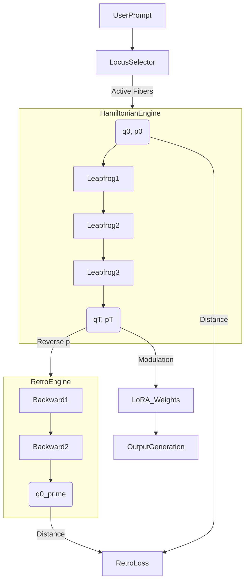

# MANIFOLD_GL_PHASE2_GIST.md

## 1. Theoretical Framework

### 1.1 Phase Space on Poincaré Ball
The phase space is the cotangent bundle $T^* \mathbb{D}$.
State: $s_i = (q_i, p_i)$ where $q_i \in \mathbb{D}^n$ (Poincaré Ball) and $p_i \in \mathbb{R}^n$ (Tangent Space).

### 1.2 Hamiltonian
The energy function governing thought evolution:
$$ H(q, p) = \underbrace{\frac{1}{2} p^T G^{-1}(q) p}_{\text{Kinetic (Metric)}} + \underbrace{V_{\text{geo}}(q)}_{\text{Curvature Potential}} + \underbrace{V_{\text{sem}}(q)}_{\text{Semantic Potential}} $$

*   $G^{-1}(q)$: Inverse metric tensor (conformal factor of Poincaré Model).
*   $V_{\text{geo}}(q)$: Enforces manifold constraints (e.g., stay within ball).
*   $V_{\text{sem}}(q)$: Couples the fiber to the "Conceptual Layer" (Blue nodes in analysis).

### 1.3 Retrospection Loss (The "Memory" Signal)
We enforce time-reversal symmetry to ensure information conservation.
Let $\Phi_T: T^*\mathcal{M} \to T^*\mathcal{M}$ be the flow operator (Leapfrog integrator).

**Forward**: $(q_T, p_T) = \Phi_T(q_0, p_0)$
**Reversal**: $(\tilde{q}_T, \tilde{p}_T) = (q_T, -p_T)$
**Backward**: $(q'_0, p'_0) = \Phi_T(\tilde{q}_T, \tilde{p}_T)$

$$ \mathcal{L}_{\text{retro}} = d_{\mathcal{M}}(q_0, q'_0)^2 + \|p_0 - (-p'_0)\|^2 $$

## 2. Implementation Specifications

### 2.1 Fiber State Representation (Option A)
```python
@dataclass
class FiberState:
    z: torch.Tensor          # Shape [d], the position q on manifold
    p: torch.Tensor          # Shape [d], the momentum p
    chart_idx: int           # For multi-chart atlases (Phase 3)
    log_metric: torch.Tensor # Parameterized metric G
```

### 2.2 Symplectic Integrator (Leapfrog)
To preserve the Hamiltonian structure, we must use a symplectic integrator, not Euler.
```python
def leapfrog_step(q, p, grad_V, step_size):
    # Half step for momentum
    p_half = p - 0.5 * step_size * grad_V(q)
    
    # Full step for position (Geodesic flow)
    # On Euclidean: q_new = q + step_size * G^-1 * p_half
    # On Manifold: q_new = exp_map(q, step_size * p_half)
    q_new = exp_map(q, step_size * p_half)
    
    # Half step for momentum
    p_new = p_half - 0.5 * step_size * grad_V(q_new)
    
    return q_new, p_new
```

### 2.3 Effect Discipline (Section 4.3)
Updates to fibers must respect the `AllowedTargets` closure.
*   **Adjacency**: Define graph $G_{adj} = (V, E_{tree} \cup E_{overlap})$.
*   **Propagate**: If fiber $i$ updates, neighbors $j \in N(i)$ can update.
*   **Anchor Off-Locus**: Any fiber $k \notin \text{Closure}(Allowed)$ decays to previous state.
$$ z_k^{(t+1)} = \alpha z_k^{(t)} + (1-\alpha) z_k^{(prev)} $$

## 3. Architecture

